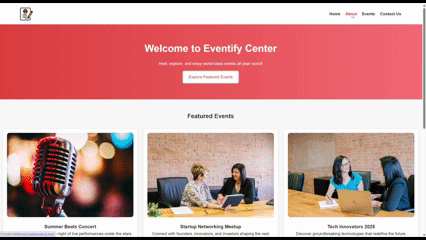

# 🎨 Frontend Practice Projects

A collection of my **HTML and CSS practice projects**, where I explore different frontend concepts — from layouts and responsive design to UI components and animations.

---

## 🌟 Featured Projects

### 🧭 Eventify Center

Host, explore, and enjoy world-class events all year round.
A responsive event showcase page with modern layout and styling.



**Tech Stack:**
`HTML`, `CSS`, `Flexbox`, `Responsive Design`

---

### 🍽️ FoodSpot

A stylish food website landing page featuring hero sections, menu highlights, and a clean navigation bar.


**Tech Stack:**
`HTML`, `CSS`, `Background Overlay`, `Flexbox`, `Media Queries`

---

## 🗂️ Other Projects

| Folder                 | Description                                  |
| ---------------------- | -------------------------------------------- |
| **BasicsHtml**         | HTML structure and tags practice             |
| **BoxModel**           | Experiments with CSS box model               |
| **CSS-reinforcement**  | Styling exercises to reinforce CSS concepts  |
| **CSS-styles**         | Custom styles and layout experiments         |
| **DeliciousFood**      | A mini food website concept                  |
| **Figma**              | HTML/CSS implementation from Figma design    |
| **Flexbox**            | Layout practice using CSS Flexbox            |
| **Hamburger-menu**     | Responsive navbar with toggle animation      |
| **HelloWorld**         | Basic HTML project                           |
| **How-Internet-Works** | Notes and illustrations on how the web works |
| **Images**             | Images of Projects                           |
| **Landingpage**        | General responsive landing page design       |
| **Media-query**        | Responsive layouts using CSS media queries   |
| **Navbar**             | Different navigation bar designs             |
| **Profilecard**        | A simple HTML/CSS profile card               |
| **css_notes.md**       | Notes and references on CSS                  |

---

## ⚙️ How to Run Locally

1. Clone the repository:

   ```bash
   git clone https://github.com/priyanka5123/demo-html.git
   ```
2. Open any project folder in VS Code.
3. Run the HTML file in your browser to see it live.

---

## 🛠️ Tools Used

* HTML5
* CSS3
* Flexbox
* Media Queries
* Figma (for design references)

---

